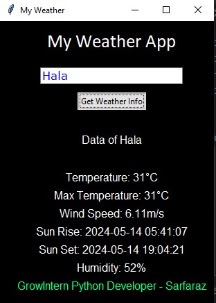

## Welcome to Repo
Here is all projects created during the internship at [GrowIntern](https://growintern.com/).

### Weather GUI App
A Weather GUI App created with Python that allows you to enter a city name and retrieve the current weather details for that location, including temperature, humidity, wind speed, and weather description.

_More will coming soon!_